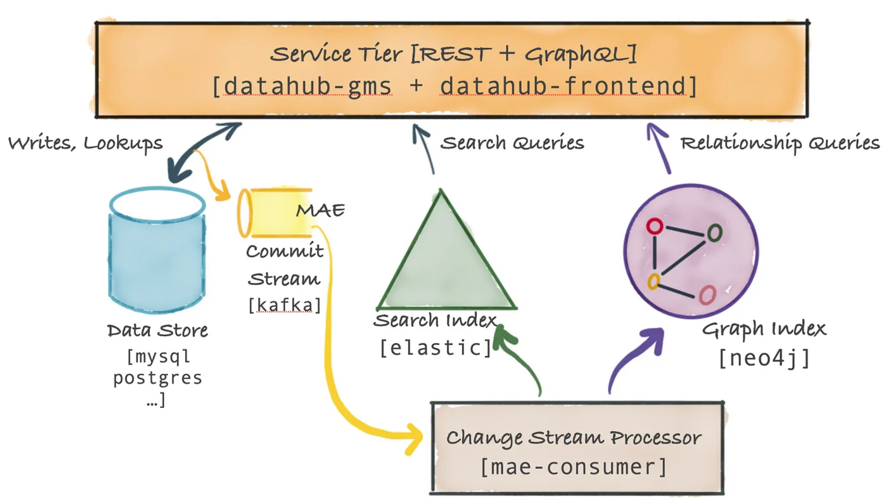
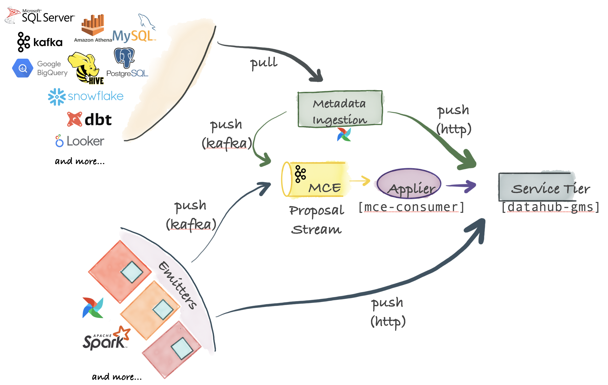

# Datahub

1. Datahub frontend

2. Datahub GMS(Metadata Service) : GraphQL API for fetching and mutating objects in a metadata graph, and Rest.li API for ingesting storage models for the metadata graph

3. Datahub MCE( Metadata Change Event ) : Listens change events emitted by clients of DataHub which request changes to the Metadata Graph and applies these requests to the Metadata Service which is Datahub's storage layer.

    Consumes from kafka topics:
    - `MetadataChangeProposal_v1`

    Produces to kafka topics:
    - `FailedMetadataChangeProposal_v1`

4. Datahub MAE( Metadata Audit Event ) : Listens change log events emitted as a result of changes made to the Metadata Graph and converts changes into secondary search & graph indexes.  

    Consumes from kafka topics:
    - `MetadataChangeLog_Versioned_v1`
    - `MetadataChangeLog_Timeseries_v1`


#### External services( Prerequisites ):
1. Elastic Search
2. A Graph Database : Elastic Search or Neo4j or DGraph ( Optional )
3. A relational Database : MySQL or PostgreSQL, etc
4. Kafka

### Ingestion


#### Pull-based integration

DataHub ships with a Python based metadata-ingestion system that can connect to different sources to pull metadata from them. This metadata is then pushed via Kafka or HTTP to the DataHub storage tier. Metadata ingestion pipelines can be integrated with Airflow to set up scheduled ingestion or capture lineage.

#### Push-based integration
As long as you can emit a Metadata Change Proposal (MCP) event to Kafka or make a REST call over HTTP, you can integrate any system with DataHub. For convenience, DataHub also provides simple Python emitters for you to integrate into sources to emit metadata changes (MCP-s) at the point of origin.

# Deploy Datahub on local kubernetes cluster

## Diagram
```
                datahub-frontend-react  datahub-actions
                                     \   /
                                       |   datahub-upgrade (NoCodeDataMigration, helm only)
                                       |   /
                                datahub-gms (healthy)
                                       |
                                datahub-upgrade (SystemUpdate completed)
            /--------------------/   |   \   \------------------------------------------------\
           /                         |    \-------------------\                                \
mysql-setup (completed)  elasticsearch-setup (completed)  kafka-setup (completed)  (if apply) neo4j (healthy)
    |                           |                          /         \
    |                           |                         /           \
mysql (healthy)         elasticsearch (healthy)   broker (healthy)  (if not internal) schema-registry  (healthy)
                                                      |
                                                  zookeeper (healthy)
``````
[Datahub Docker Container Architecture](https://datahubproject.io/docs/architecture/docker-containers)

## Commands
```
Available recipes:
    add-helm                add helm charts
    create-secret           create secret for postgresql in cluster
    datahub-delete          delete datahub chart
    datahub-deps            build datahub dependency
    datahub-install         install datahub chart
    datahub-update          update datahub chart for values change
    kind-config             check configuration for kind cluster
    kind-down               delete kind cluster
    kind-up                 create kind cluster
    prep-delete             delete prerequisites chart
    prep-install            install prerequisites chart
    prep-update             update prerequisites chart
```

## Resources
```
$ kubectl get pods
NAME                                                READY   STATUS
datahub-acryl-datahub-actions-6fdcd88558-qmzs6      1/1     Running
datahub-datahub-frontend-7d486c55df-6rvwc           1/1     Running
datahub-datahub-gms-77764b4c54-tw6lq                1/1     Running
datahub-datahub-mae-consumer-7d945584c7-b8fm7       1/1     Running
datahub-datahub-mce-consumer-7c48d8dcc6-h4k8j       1/1     Running
datahub-datahub-system-update-job-7wkxh             0/1     Completed
datahub-elasticsearch-setup-job-55j96               0/1     Completed
datahub-kafka-setup-job-7t8mw                       0/1     Completed
datahub-nocode-migration-job-vsccx                  0/1     Completed
datahub-postgresql-setup-job-zc9kh                  0/1     Completed
elasticsearch-master-0                              1/1     Running
elasticsearch-master-1                              1/1     Running
elasticsearch-master-2                              1/1     Running
prerequisites-cp-schema-registry-7cc6786995-gdfx9   2/2     Running
prerequisites-kafka-0                               1/1     Running
prerequisites-postgresql-0                          1/1     Running
prerequisites-zookeeper-0                           1/1     Running
```

## Reference
- helm charts from [datahub-helm](https://github.com/acryldata/datahub-helm)
- [Deploying DataHub with Kubernetes](https://datahubproject.io/docs/deploy/kubernetes/)
